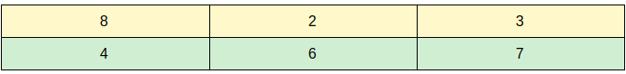

# Introduction
<p>
This project was done in order to learn how we can use a genetic algorithm to solve complex problems. 
</p>
<p>The problem we face in this project is that we want to get rid of our legos by building models. However, it's impossible to get rid of them without having to buy other parts.</p>

# Example
## Cost and Current Legos
The <span style="color : yellow"> first row</span> represents the price of each type of lego and the <span style="color : green"> second row</span> represents the current total we have for each type of lego. For example, for the first lego we have 4 parts and the cost of each piece of the first lego is 8$


## Models
This <span style="color : blue"> table</span> represents the models we can construct. For each model, we have an array of numbers that represents the number of parts of each lego needed in order to construct this model. For example, the model [1, 0, 1] means that we need 1 of the first type of lego, 0 of the second type of lego and 1 of the third type of lego.


## Possible solution
[4, 6, 7] - <span style="color : blue"> [2, 4, 4]</span> = [2, 2, 3]<br>
[2, 2, 3] - <span style="color : blue"> [2, 4, 4]</span> = [0, -2, -1]<br>

[0, -2, -1] * [8, 2, 3] = -7 <br>

Therefore, we need to spend 7$ in order to construct twice the third model


## Data
Data Information by line
<ol>
  <li>Number of legos by type</li>
  <li>Current Legos</li>
  <li>Lego cost for each type</li>
  <li>Number of models</li>
  <li>From this line to the end is all possible model configurations</li>
</ol> 


# How to run the the script
 In order to start the algorithm you need to entrer this command : 
 ```bash
    ./run.sh -e /home/ayoub/Desktop/genetic_algorithm/exemplaires/LEGO_50_50_100
```
after -e you need to provide the path of the data.
